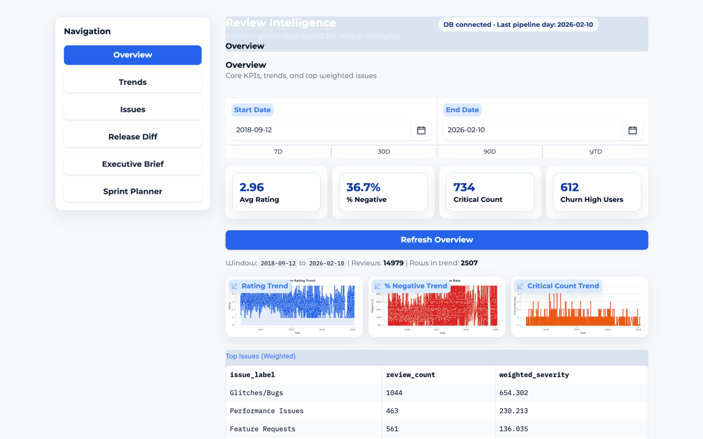
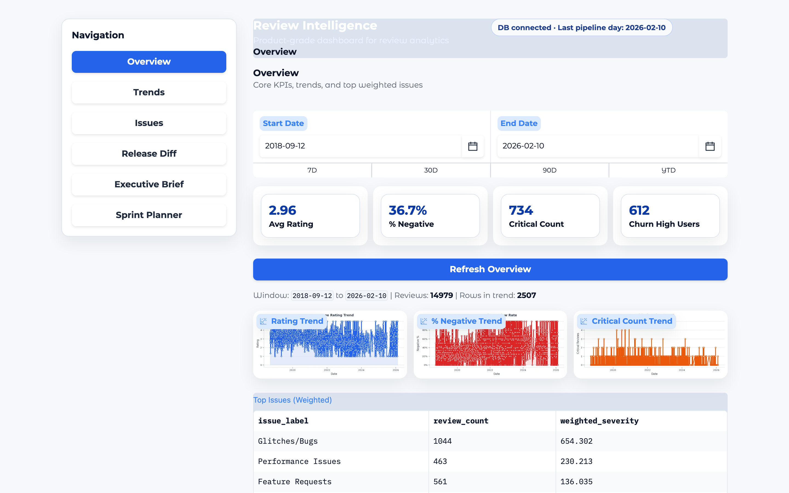
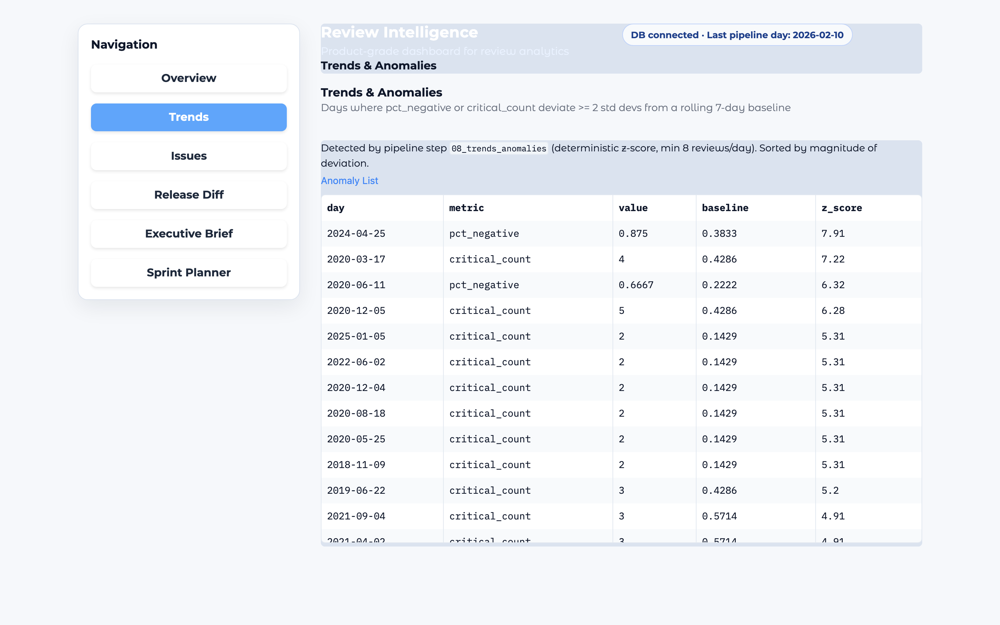
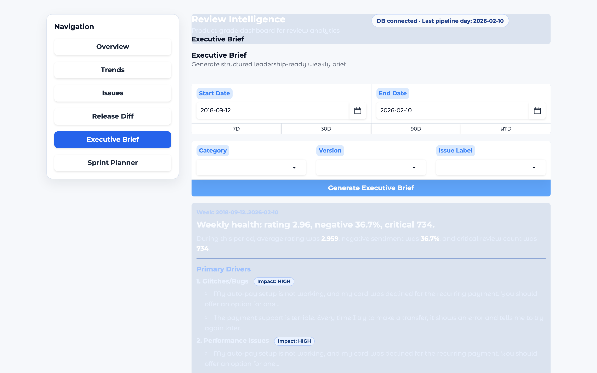
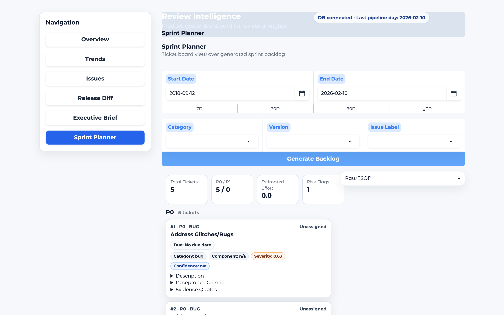

# Review Intelligence System

Turn ~15,000 raw app-store reviews into an executive-ready dashboard and
LLM-written insights — KPIs, trends, anomalies, drilldowns, a weekly executive
brief, and a sprint backlog — without training or fine-tuning any model.

## The problem

A product team can read 50 reviews. It can't read 15,000. So the signal — what's
actually breaking, who's about to churn, what changed since the last release —
stays buried in a spreadsheet nobody opens. The expensive part isn't collecting
reviews; it's turning them into judgment a PM or exec can act on this week.

This project is my answer: a deterministic pipeline does the counting and
scoring it can be trusted with, and an LLM does only the part it's good at —
narrating and prioritising — on top of numbers it isn't allowed to invent.

## See it

**▶ Live demo: https://huggingface.co/spaces/muneebahmadch/review-intelligence-system**



| Overview | Trends & Anomalies |
|---|---|
|  |  |
| **Executive Brief (LLM)** | **Sprint Planner (LLM)** |
|  |  |

Screenshots are of the real app running on the included sample data — KPIs (avg
rating 2.96, 36.7% negative, 734 critical, 612 high-churn users), a multi-year
trend, a z-score anomaly list, and the two LLM insights served from the committed
cache.

## How it works

```
3 CSVs · 15,000 rows
      │  00 ingest + dedupe on reviewId  →  14,979 unique reviews
      ▼
  reviews_raw ─────────── DuckDB ───────────────────────────────┐
      │                                                          │
      │ 01 normalize · 02 sentiment (lexicon+rating rules) ·     │
      │ 03 issues (keyword/regex multi-label) · 04 severity      │
      │ (deterministic formula) · 05 churn (per-user heuristic)  │
      ▼                                                          │
  reviews_enriched                                               │
      │ 06 daily aggregates · 07 version aggregates ·            │
      │ 08 anomalies (rolling 7-day z-score)                     │
      ▼                                                          │
  daily_aggregates · version_aggregates · user_churn            │
      │ 09 insight materialization                               │
      ▼   ┌─ grounded input: KPI counts + top issues +           │
  insight_reports │  real evidence quotes                        │
      │           ├─ LLM writes JSON (Claude or local Ollama)    │
      │           ├─ validated against a JSON schema             │
      │           └─ quotes filtered to real reviews, KPI        │
      │              numbers pinned to computed values           │
      ▼                                                          ▼
            Gradio dashboard (Overview · Trends · Issues · Release Diff ·
            Executive Brief · Sprint Planner)
```

**Deterministic first.** Sentiment, issue labels, severity, churn, aggregates,
and anomalies are all plain Python/SQL with explicit formulas — see
[`PLAN.md`](PLAN.md) §6 for the severity and KPI definitions. They're
reproducible and testable; no model is in this path.

**LLM only where judgment helps.** Two features call an LLM: the **Weekly
Executive Brief** and the **Sprint Backlog**. The model never sees raw data and
is never asked for a number. It receives a small JSON payload — the KPI snapshot,
the top weighted issues, and ten real evidence quotes — and writes structured
output. The prompts are plain files in [`llm/prompts/`](llm/prompts/) and the
output shapes are JSON schemas in [`llm/schemas/`](llm/schemas/).

**How the LLM is kept honest** (`llm/grounding.py`):
- KPI numbers in the output are overwritten with the figures computed from
  DuckDB, so a headline can't drift from the data.
- Every cited quote must substring-match one of the real review excerpts passed
  in; anything paraphrased or hallucinated is dropped.
- The output is validated against a JSON schema, with a repair-retry, before it
  is shown or cached.

**Provider precedence** (`llm/provider.py`): Claude (`claude-opus-4-8`) if
`ANTHROPIC_API_KEY` is set → local Ollama / Llama 3.2 if reachable → otherwise a
deterministic grounded fallback. Whatever runs, the result is cached in DuckDB,
so the hosted demo shows real insight outputs with **no API key and no GPU**.
(The cached samples committed here were generated with Llama 3.2 via Ollama.)

## What works today vs. roadmap

**Works today, end-to-end, on the included data:**
- Ingest → normalize → enrich → aggregate pipeline over 14,979 unique reviews
  (steps 00–09), reproducible with one command.
- Rule-based sentiment, rule-based multi-label issue tagging (8 issue labels),
  deterministic severity scoring, per-user churn heuristic (612 high-risk users),
  daily + version aggregates (2,748 versions), z-score anomaly detection
  (120 flagged days).
- Gradio dashboard, 6 tabs: Overview (KPIs + trends + top issues), Trends &
  Anomalies, Issues drilldown (filters + evidence quotes), Release Diff (version
  deltas), Executive Brief (LLM), Sprint Planner (LLM).
- Grounded LLM insight layer with JSON-schema validation and cached sample
  outputs that ship in the committed DuckDB.
- A small test suite (`pytest`) covering ingest/schema and KPI sanity.

**Roadmap — sketched in [`PLAN.md`](PLAN.md) but not built yet (honest list):**
- LLM adjudication for low-confidence sentiment/issues. Today enrichment is
  **100% rule-based**; the hybrid rule+LLM path is designed but not wired.
- The other GenAI features in PLAN.md (PRD snippets, support macros, competitor
  extraction, persona summaries, "explain this spike", board-slide export).
- Semantic issue clustering with embeddings (current "clustering" is keyword
  rules).
- Golden-set evaluation harness (sentiment accuracy / issue precision@k).

## Run it (verified)

From a clean clone in a fresh virtualenv:

```bash
python -m venv .venv
source .venv/bin/activate          # Windows: .venv\Scripts\activate
pip install -r requirements.txt
python -m app.gradio_app           # → http://127.0.0.1:7861
```

The dashboard runs immediately on the **committed** DuckDB (`data/db/reviews.duckdb`),
including the cached insights — no pipeline run required.

**Rebuild the database from the CSVs** (optional):
```bash
bash scripts/run_pipeline.sh       # runs steps 00–09
```

**Generate insights live instead of from cache** (optional):
```bash
export ANTHROPIC_API_KEY=sk-...    # uses Claude; or run a local Ollama server
```

**Tests:**
```bash
pytest -q
```
> Note: the tests re-run early pipeline steps against the local DB, leaving it in
> a partial state. Run `bash scripts/run_pipeline.sh` afterwards to restore the
> full dataset.

## Deploy

This repo is also a Hugging Face Space (config is the YAML front-matter at the
top of this file; `app.py` is the entrypoint). To publish:

```bash
pip install -U "huggingface_hub[cli]"
hf auth login
hf upload <your-username>/review-intelligence-system . --repo-type=space --create
```

The Space serves the committed database and cached insights out of the box. Add
`ANTHROPIC_API_KEY` as a Space secret to generate insights live with Claude.

## Why I built this

I wanted one honest artifact that shows how I build *with* AI, not a demo that
falls over when you click into it. So I drew a hard line: deterministic code owns
every number, and the model only writes prose over numbers it can't change. The
grounding guardrails and the JSON-schema-validated cache are the parts I'm
proudest of — they're what let me put "insights cite real reviews, not
hallucinations" in a README and mean it. It's an MVP with a real roadmap, and
I've kept the README's "what works vs. roadmap" split honest on purpose.

— Muneeb

## License

MIT — see [LICENSE](LICENSE).
